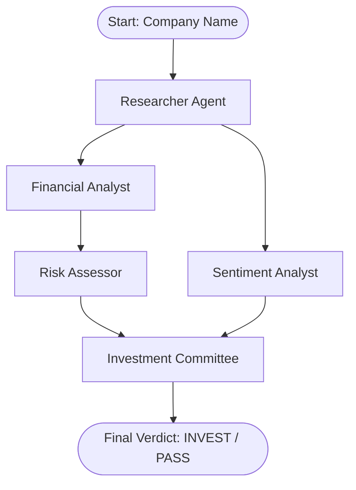

# AI Investment Research Agent (InsideIIM × Altuni AI Labs)

A production-grade, autonomous **AI Investment Research Agent** that performs deep corporate scans, market analyses, regulatory risk profiles, and sentiment audits to deliver structured investment verdicts. 

It is built on a highly optimized, parallelized **LangGraph.js** workflow with a premium, mobile-responsive **Skeuomorphic & Claymorphic Dashboard** that includes real-time SSE data streaming and print-ready PDF reports.

---

## 1. Core Architecture (LangGraph.js Fan-Out Pipeline)

To maximize throughput and execution speed, the backend executes a parallelized acyclic graph built on **LangGraph.js**:



### Specialized Agents:
1. **Researcher Agent:** Performs targeted search queries (via Serper API) to pull filing reports, core segments, and recent business news.
2. **Financial Analyst Agent:** Conducts a SWOT analysis and parses monetization models and competitive moats.
3. **Risk Assessor Agent:** Identifies regulatory, operational, market, financial, and macroeconomic risks and assigns severity (Low, Medium, High, Critical).
4. **Sentiment Analyst Agent:** Evaluates news tone, market narrative, and analyst consensus (Bullish, Bearish, Neutral).
5. **Investment Committee Agent:** Consolidates all inputs to issue a final **INVEST / PASS** verdict, conviction score (0-100), and structured investment thesis.

### Key Optimization (Fan-Out/Fan-In):
* **Old Architecture (~35-45s):** Fully sequential execution (Researcher → Analyst → Risk → Sentiment → Committee).
* **New Parallel Architecture (~12-18s):** Fan-out structure where **Analyst** and **Sentiment** run in parallel immediately after Researcher. Risk runs sequentially after Analyst (due to SWOT dependency), and Committee aggregates all branches (fan-in) for the final verdict.

---

## 2. UI/UX Design Aesthetics

The interface is built from the ground up using **React + Next.js + Vanilla CSS** and focuses on high-specularity, tactile, physical depth:
* **Skeuomorphic Elements:** Glossy glassmodal backdrops, linear specular glare overlays, and 3D beveled borders reflecting top-left lighting.
* **Claymorphic Agent Nodes:** Interactive orbiting indicator nodes representing each active agent. Orbs have custom inflated gradients (emerald green for done, blue for active) with double inner shadows (`inset`) to create a smooth, physical plastic/clay appearance.
* **Liquid Glass Modals:** Seamless glassmorphic details with saturating backdrops for previewing and printing reports.
* **Universal Responsiveness:** Fully scaled container sizing, node spacing, and card layouts for mobile phones, tablets, and desktop screens.
* **Print Optimization:** Injects custom black-and-white layouts via CSS `@media print` rules, allowing users to save/print report sheets directly to clean, paper-ready black-and-white PDFs.

---

## 3. Tech Stack
* **Framework:** Next.js (App Router, Turbopack, React 19)
* **Agentic Framework:** `@langchain/langgraph` & `@langchain/core`
* **LLM Engine:** Gemini 2.5 Flash / Groq Llama-3.3-70b (customizable via env)
* **Search APIs:** Serper.dev (Google Search API)
* **Charts:** Recharts

---

## 4. Setup & Running Locally

### Prerequisites
Make sure you have Node.js (v18+) and npm installed.

### 1. Clone the project and install dependencies
```bash
cd code
npm install
```

### 2. Configure Environment Variables
Create a `code/.env.local` file with the following keys:
```env
# Gemini API Key (Default LLM provider)
GEMINI_API_KEY=your_gemini_api_key

# Serper API Key (For web search research)
SERPER_API_KEY=your_serper_api_key

# (Optional) Groq API Key if opting for Llama models
GROQ_API_KEY=your_groq_api_key
```

### 3. Run the Development Server
```bash
npm run dev
```
Open [http://localhost:3000](http://localhost:3000) to view the application.

### 4. Build & Production Check
To compile and test production static optimization:
```bash
npm run build
```

---

## 5. Key Decisions & Trade-Offs

1. **Vanilla CSS over Tailwind:** Hand-crafted CSS modules were chosen to gain absolute pixel-perfect control over complex inner shadow offsets, custom glare transforms, and claymorphic transitions which are verbose and complex to model in standard utility classes.
2. **Local State Streaming (Server-Sent Events):** The Next.js API route streams LangGraph step transitions incrementally (`data: { agent: stateUpd }`) to allow the UI to highlight active agents immediately instead of waiting for the entire 15-second graph execution to finish.
3. **Mock Market fallback:** Integrates public Yahoo Finance market tickers, but falls back to a clean simulated historical trend chart for private or unlisted targets.

---

## 6. AI Assistance, Tools & Methodology

We leveraged state-of-the-art AI systems and methodologies during development to deliver a premium user experience:
* **Imagine Image Generator:** Used to generate high-fidelity, matching visual assets (e.g., custom agent avatar JPGs and cinematic hero background panels).
* **Claude (Anthropic):** Utilized for structuring system instructions, planning prompt strategies for each specific node, and validating agentic state transition logic.
* **SkillUI Framework:** Used to structure and design the custom skeuomorphic dashboard controls and layouts.
* **Google Flow:** Provided guidelines for user interaction loops, orbital agent loaders, and loading animations.

