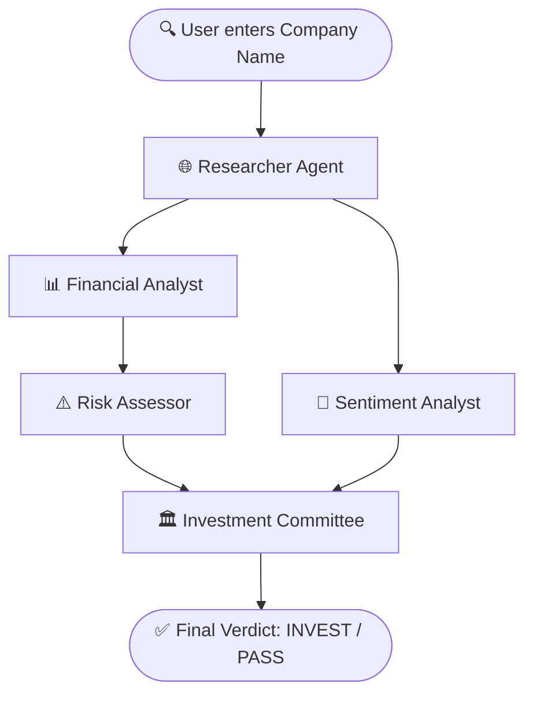

# 🧠 AI Investment Research Agent

### 🔗 **[▶ LIVE DEMO — investement-bxwf.vercel.app](https://investement-bxwf.vercel.app)**

> A production-grade, autonomous **AI Investment Research Agent** that performs deep corporate scans, market analyses, regulatory risk profiles, and sentiment audits to deliver structured **INVEST / PASS** verdicts — powered by a parallelized **5-agent LangGraph.js pipeline** with a premium **Skeuomorphic & Claymorphic Dashboard**.

---

## 📖 Table of Contents
1. [Overview — What It Does](#1-overview--what-it-does)
2. [How to Run It — Setup & Run Steps](#2-how-to-run-it--setup--run-steps)
3. [How It Works — Architecture & Approach](#3-how-it-works--architecture--approach)
4. [Key Decisions & Trade-Offs](#4-key-decisions--trade-offs)
5. [Example Runs — Agent Output Samples](#5-example-runs--agent-output-samples)
6. [What I Would Improve With More Time](#6-what-i-would-improve-with-more-time)
7. [AI Tools & LLM Usage (BONUS)](#7-ai-tools--llm-usage-bonus)
8. [Project Structure](#8-project-structure)

---

## 1. Overview — What It Does

**🔗 Live App: [https://investement-bxwf.vercel.app](https://investement-bxwf.vercel.app)**

This application takes a **company name** as input and autonomously runs a 5-agent AI research pipeline to produce:

| Output | Description |
|--------|-------------|
| **Research Brief** | Key facts, business model, competitors, recent news gathered from live web search |
| **SWOT Analysis** | Strengths, Weaknesses, Opportunities, Threats — structured financial analysis |
| **Risk Assessment** | Regulatory, operational, market, financial, and macroeconomic risks with severity ratings (Low → Critical) |
| **Sentiment Analysis** | News tone, market narrative, and analyst consensus (Bullish / Bearish / Neutral) |
| **Final Verdict** | **INVEST** or **PASS** decision with a conviction score (0–100), investment thesis, and risk mitigation plan |
| **Stock Chart** | Real-time 30-day historical stock price chart (via Alpha Vantage / Yahoo Finance fallback) |
| **Follow-up Chat** | Interactive AI chatbot sidebar for asking follow-up questions about the analysis |

The entire pipeline runs in **~12–18 seconds** with real-time progress streaming.

---

## 2. How to Run It — Setup & Run Steps

### Prerequisites
- **Node.js** v18+ and **npm** installed
- API keys (free tiers available for all)

### Step 1: Clone and Install
```bash
git clone https://github.com/Meherpra/investement.git
cd investement
npm install
```

### Step 2: Configure Environment Variables
Create a `.env.local` file in the root directory:
```env
# 1. Groq API Key (Analyst + Risk + Sentiment + Committee agents)
# Get one free at: https://console.groq.com/keys
GROQ_API_KEY=your_groq_api_key_here

# 2. Serper.dev API Key (Researcher agent — Google Search)
# Get 2500 free searches at: https://serper.dev
SERPER_API_KEY=your_serper_api_key_here

# 3. Alpha Vantage API Key (Optional — Historical stock data charts)
# Get a free key at: https://www.alphavantage.co/support/#api-key
ALPHA_VANTAGE_API_KEY=your_alpha_vantage_key_here
```

### Step 3: Run the Development Server
```bash
npm run dev
```
Open **[http://localhost:3000](http://localhost:3000)** in your browser.

### Step 4: Build for Production
```bash
npm run build
npm start
```

### Deployed Version
> **🔗 No setup needed — try the live app directly: [https://investement-bxwf.vercel.app](https://investement-bxwf.vercel.app)**

---

## 3. How It Works — Architecture & Approach

### 3.1 Agent Pipeline (LangGraph.js Fan-Out/Fan-In)



**Key Optimization — Parallel Fan-Out:**
| Architecture | Execution Time |
|---|---|
| ❌ Old Sequential (Researcher → Analyst → Risk → Sentiment → Committee) | ~35–45 seconds |
| ✅ **New Parallel** (Analyst + Sentiment run concurrently after Researcher) | **~12–18 seconds** |

### 3.2 The Five Agents

| # | Agent | Role | LLM | Input |
|---|-------|------|-----|-------|
| 1 | **Researcher** | Web search via Serper API — gathers news, financials, competitors | Groq Llama-3.3-70b | Company name |
| 2 | **Financial Analyst** | SWOT analysis, competitive moat, revenue model breakdown | Groq Llama-3.1-8b | Research brief |
| 3 | **Sentiment Analyst** | News tone, market narrative, analyst consensus | Groq Llama-3.1-8b | Research brief |
| 4 | **Risk Assessor** | Identifies 5 risk categories with severity ratings | Groq Llama-3.1-8b | SWOT analysis |
| 5 | **Investment Committee** | Final INVEST/PASS verdict, conviction score, thesis | Groq Llama-3.1-8b | All agent outputs |

### 3.3 Frontend Architecture

- **Framework:** Next.js 16 (App Router, Turbopack, React 19)
- **Styling:** 100% Vanilla CSS — hand-crafted skeuomorphic, claymorphic, and glassmorphic design system
- **Data Streaming:** Server-Sent Events (SSE) from Next.js API route → real-time UI updates as each agent completes
- **Charts:** Recharts for interactive stock price visualization
- **Deployment:** Vercel (standalone output mode)

### 3.4 Real-Time Streaming Flow
```
User submits company name
    → POST /api/invest (SSE stream)
        → LangGraph runs agents
        → Each agent completion emits: data: { "agentName": { ...stateUpdate } }
        → Frontend receives SSE events and updates UI progressively
        → Orbital loader highlights each agent as it activates
    → data: [DONE]
    → Full results dashboard renders
```

---

## 4. Key Decisions & Trade-Offs

### What I Chose and Why

| Decision | Rationale |
|----------|-----------|
| **Vanilla CSS over Tailwind** | Needed absolute pixel-level control for complex inner shadow offsets, custom specular glare transforms, and claymorphic transitions. These are extremely verbose and hard to model with utility classes. |
| **Groq (Llama-3.3-70b) over OpenAI/Gemini** | Free tier with extremely fast inference (~2–5s per agent). Enables the entire pipeline to complete in ~15s. Falls back to Llama-3.1-8b on rate limits. |
| **Server-Sent Events over WebSockets** | SSE is simpler, unidirectional (server → client), and natively supported by Next.js API routes. No WebSocket server needed. Perfect for streaming agent progress. |
| **LangGraph.js over raw LangChain** | Provides built-in support for parallel fan-out/fan-in execution patterns, state management, and graph visualization. Much cleaner than manual Promise.all chains. |
| **Alpha Vantage + Yahoo Finance fallback** | Alpha Vantage provides clean daily OHLC data. Yahoo Finance acts as automatic fallback for rate-limited or unavailable tickers. Private companies show graceful "no data" state. |

### What I Left Out (Scope Constraints)
- **User authentication** — not needed for a demo/assignment scope
- **Database persistence** — results are ephemeral per session; would add Supabase/Postgres for production
- **PDF export API** — currently uses browser `window.print()` with CSS `@media print` optimization; a server-side PDF renderer (Puppeteer) would be better for production
- **Multi-company comparison** — would be a great feature to compare two companies side-by-side

---

## 5. Example Runs — Agent Output Samples

### Example 1: Tesla
| Field | Output |
|-------|--------|
| **Verdict** | ✅ INVEST |
| **Conviction Score** | 72/100 |
| **Key Strengths** | Market leader in EVs, strong brand, vertical integration, energy business diversification |
| **Key Risks** | Regulatory scrutiny, Elon Musk concentration risk, increasing EV competition from BYD/legacy automakers |
| **Sentiment** | Bullish — strong retail investor sentiment, positive analyst coverage |

### Example 2: Apple
| Field | Output |
|-------|--------|
| **Verdict** | ✅ INVEST |
| **Conviction Score** | 85/100 |
| **Key Strengths** | Unmatched ecosystem lock-in, services revenue growth, massive cash reserves |
| **Key Risks** | China supply chain dependence, antitrust regulation in EU, smartphone market saturation |
| **Sentiment** | Bullish — consistent institutional accumulation, strong dividend profile |

### Example 3: OpenAI (Private Company)
| Field | Output |
|-------|--------|
| **Verdict** | ⏸️ PASS |
| **Conviction Score** | 45/100 |
| **Key Strengths** | Leading AI research lab, ChatGPT brand dominance, Microsoft partnership |
| **Key Risks** | No public financials, leadership instability history, regulatory uncertainty around AI |
| **Sentiment** | Mixed — high excitement but governance concerns |
| **Stock Data** | N/A (private company — no public ticker) |

> **🔗 Try it yourself: [https://investement-bxwf.vercel.app](https://investement-bxwf.vercel.app)**

---

## 6. What I Would Improve With More Time

1. **Multi-LLM Routing:** Dynamically route different agents to the best-suited model (e.g., GPT-4o for committee reasoning, Llama for fast analysis tasks)
2. **Persistent Storage:** Save past analyses in a database (Supabase/PostgreSQL) so users can revisit and compare historical reports
3. **PDF Export API:** Server-side PDF generation via Puppeteer for cleaner, branded PDF reports with charts
4. **Multi-Company Comparison:** Side-by-side analysis dashboard comparing two or more companies
5. **Real-Time SEC Filings:** Integrate SEC EDGAR API to pull actual 10-K/10-Q filings data for deeper financial analysis
6. **User Authentication:** Add auth (NextAuth) so users can save searches and build a personal research library
7. **Agent Memory:** Implement conversational memory across the chat sidebar so follow-up questions have full context of the analysis

---

## 7. AI Tools & LLM Usage (BONUS)

This entire project was built using AI/LLM assistance throughout development. Here are the specific tools and how they were used:

### 🤖 LLMs Used During Development

| Tool | How It Was Used |
|------|----------------|
| **Claude (Anthropic)** | Primary coding assistant — used for structuring agent system prompts, planning the LangGraph topology, debugging SSE streaming, and validating state transition logic |
| **Gemini (Google)** | Used as an alternative reasoning engine for prompt refinement and architecture discussions |

### 🎨 AI Design & Creative Tools

| Tool | How It Was Used |
|------|----------------|
| **SkillUI** | Used for replicating and modeling premium website UI patterns — structured the skeuomorphic dashboard controls, beveled borders, and interactive card layouts |
| **Google Flow** | Provided design guidelines and inspiration for user interaction loops, orbital agent loader animations, CSS keyframe movements, and the overall cinematic dashboard flow |
| **Imagine 3 (Image Generation)** | Generated all custom visual assets from scratch — the 5 agent avatar profile images (researcher, analyst, risk, sentiment, committee) and the cinematic dark-space hero background panel |

### 💬 LLM Chat Session Transcripts
All LLM chat session transcripts and logs from the development process are included in the `chat-logs/` directory:
- **`chat-logs/llm_chat_transcript.jsonl`** — Full JSONL transcript of LLM interactions during development

These transcripts demonstrate the thought process, iterative prompt engineering, debugging sessions, and design decisions made throughout the project.

---

## 8. Project Structure

```
investement/
├── app/                          # Next.js App Router
│   ├── page.tsx                  # Homepage — hero, search, agent cards
│   ├── layout.tsx                # Root layout with metadata
│   ├── globals.css               # Complete design system (8KB+ of hand-crafted CSS)
│   ├── types.ts                  # TypeScript interfaces for agent state
│   ├── results/
│   │   └── page.tsx              # Results page — orbital loader + dashboard
│   ├── api/
│   │   ├── invest/route.ts       # SSE streaming endpoint — runs LangGraph pipeline
│   │   └── stock/route.ts        # Stock data API (Alpha Vantage + Yahoo fallback)
│   ├── components/
│   │   ├── GenieHero.tsx         # Cinematic landing hero section
│   │   ├── SearchHero.tsx        # Company search input component
│   │   ├── AgentCardGrid.tsx     # 5-agent card grid with status indicators
│   │   ├── OrbitalLoader.tsx     # Animated orbital progress indicator
│   │   ├── ResultsDashboard.tsx  # Full analysis results dashboard (52KB)
│   │   ├── ChatSidebar.tsx       # Follow-up Q&A chat sidebar
│   │   └── GenieFooter.tsx       # Footer with credits
│   └── utils/
│       └── stock.ts              # Stock ticker resolution & data fetching
├── agents/                       # LangGraph agent definitions
│   ├── graph.ts                  # LangGraph workflow definition (fan-out/fan-in)
│   ├── state.ts                  # Agent state schema (Zod-validated)
│   └── nodes/
│       ├── researcher.ts         # Web search + data gathering agent
│       ├── analyst.ts            # Financial SWOT analysis agent
│       ├── risk.ts               # Risk assessment agent
│       ├── sentiment.ts          # Sentiment analysis agent
│       └── committee.ts          # Final verdict & thesis agent
├── chat-logs/                    # LLM interaction transcripts (BONUS)
│   └── llm_chat_transcript.jsonl
├── obsidian-vault/               # Project planning documents
│   ├── project_proposal.md
│   └── todo.md
├── public/                       # Static assets
│   ├── hero-bg.jpg               # AI-generated hero background (Imagine 3)
│   ├── agent-researcher.jpg      # AI-generated agent avatar (Imagine 3)
│   ├── agent-analyst.jpg         # AI-generated agent avatar (Imagine 3)
│   ├── agent-risk.jpg            # AI-generated agent avatar (Imagine 3)
│   ├── agent-sentiment.jpg       # AI-generated agent avatar (Imagine 3)
│   └── agent-committee.jpg       # AI-generated agent avatar (Imagine 3)
├── package.json
├── next.config.ts                # Next.js config (standalone output, Turbopack)
├── vercel.json                   # Vercel deployment config
├── tsconfig.json
└── README.md                     # ← You are here
```

---

## 📎 Links

| Resource | URL |
|----------|-----|
| **🔗 Live Demo** | **[https://investement-bxwf.vercel.app](https://investement-bxwf.vercel.app)** |
| **📦 GitHub Repo** | [https://github.com/Meherpra/investement](https://github.com/Meherpra/investement) |

---

*Built with ❤️ using Next.js, LangGraph.js, Groq, Claude, Imagine 3, Google Flow & SkillUI*
