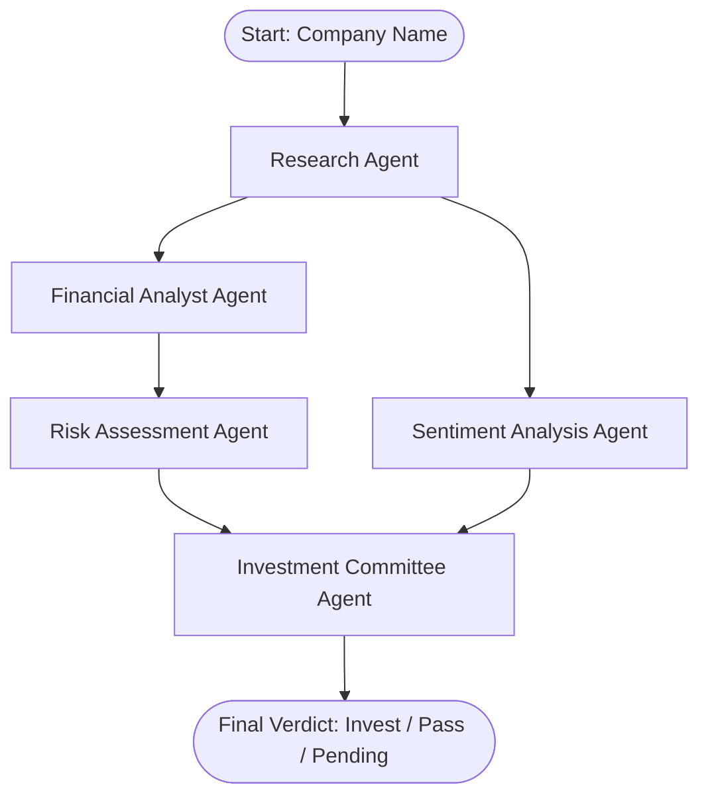

# AI Investment Research Agent — Project Proposal

We are building a production-grade **AI Investment Research Agent** using Next.js, LangGraph.js, and a sleek, premium dashboard UI.

## 1. Core Architecture (LangGraph.js)
To deliver a high-quality, high-speed agentic experience, we build a multi-agent graph with parallel fan-out/fan-in execution:

### Execution Pipeline (Parallelized Performance):
1. **Fan-Out Parallelization:** Researcher Agent gathers general company facts. Immediately after, both **Financial Analyst** and **Sentiment Analyst** execute in parallel.
2. **Sequential Dependents:** Risk Assessment Agent runs once Financial Analyst is done (as it depends on the SWOT analysis output).
3. **Fan-In Consensus:** The Investment Committee Agent waits for both Risk Assessment and Sentiment Analyst outputs, then performs synthesis and outputs the final verdict, conviction score, and investment thesis.

### The Agents:
1. **Researcher Agent:** Performs targeted web searches (via search APIs like Tavily or Serper) to gather:
   - Recent financial news, business model, product lines.
   - Competitors, market trends, and industry tailwinds.
2. **Financial Analyst Agent:** Processes the raw research and drafts:
   - A SWOT analysis (Strengths, Weaknesses, Opportunities, Threats).
   - Analysis of competitive moat and revenue streams.
3. **Risk Assessment Agent:** 
   - Evaluates market, operational, and financial risks.
   - Identifies regulatory bottlenecks and legal issues.
4. **Sentiment Analysis Agent:**
   - Analyzes recent news and social sentiment.
   - Gauges public perception and market momentum.
5. **Investment Committee Agent (Verdict Maker):**
   - Synthesizes all inputs and makes the final decision: **INVEST** or **PASS**.
   - Calculates a **Conviction Score (0-100%)**.
   - Generates a structured **Investment Thesis** and **Risk Mitigation Plan**.

---

## 2. Technical Stack
- **Frontend & Backend Framework:** Next.js (App Router, React 19, Node.js runtime).
- **Styling:** Premium Vanilla CSS Modules (Cinematic glassmorphism, true dark mode, glowing accents).
- **Agent Framework:** LangGraph.js & LangChain.js.
- **LLM Provider:** Google Gemini API (via `@langchain/google-genai` or standard SDK) or OpenAI/Anthropic.
- **Search Tool:** Tavily Search API or Google Search API.

---

## 3. UI/UX Design Goals (Cinematic Dashboard)
We will build a high-fidelity dashboard that feels cinematic and deeply immersive (inspired by Google's Project Genie):
* **Cinematic Hero Landing:** A stunning dark background with a wireframe globe, floating orbs, and glassmorphism elements to draw the user into the research flow.
* **Interactive Research Flow:** A live progress stepper showing the agent's current state (e.g., *"Researching news..."*, *"Analyzing financials..."*, *"Debating in committee..."*).
* **Verdict Banner:** A striking header showing the final **INVEST / PASS** decision with matching visual styles (Emerald green glow for Invest, Crimson red glow for Pass).
* **Metrics & Analytics widgets:** Data cards for SWOT, financials, and moat analysis.
* **Interactive Chat / Q&A:** A sidebar allowing users to ask follow-up questions about the decision (e.g., *"Why did you flag regulatory risks?"*).

---

## 4. Design Tools & AI Collaboration
We integrated specific tools and design frameworks to polish the workflow:
* **Imagine:** Image generation for all the agent-specific profile illustrations and the dark space-textured background panel.
* **Claude:** Used for formulating core agent prompts, instructions, and topological graph planning.
* **SkillUI:** Utilized for modeling beveled borders, shadows, and interactive dashboard states.
* **Google Flow:** Recommendations for implementing clean CSS keyframe movements and the orbiting indicator flows.
